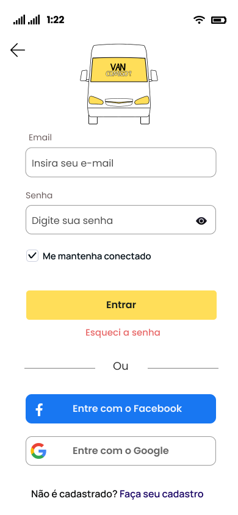
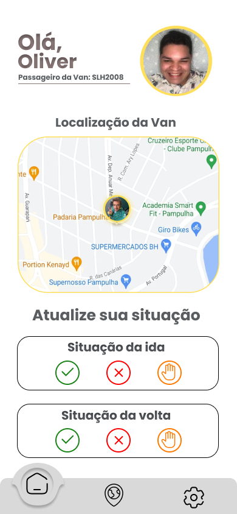

# Projeto de Interface

Pré-requisitos: <a href="2-Especificação do Projeto.md"> Documentação de Especificação</a>

Visão geral da interação do usuário pelas telas do sistema e protótipo interativo das telas com as funcionalidades que fazem parte do sistema (wireframes).

 Apresente as principais interfaces da plataforma. Discuta como ela foi elaborada de forma a atender os requisitos funcionais, não funcionais e histórias de usuário abordados nas <a href="2-Especificação do Projeto.md"> Documentação de Especificação</a>.

## Diagrama de Fluxo

Para esse projeto, teremos dois fluxos de interação do usuário em relação ao sistema: o fluxo do usuário como motorista e como passageiro.

Apesar de que ambos utilizam a ferramenta com uma mesma finalidade, agilizar e facilitar a troca de informação sobre a presença nas aulas, eles possuem finalidades e permissões diferentes dentro do VanComigo.

O diagrama apresenta o estudo do fluxo de interação do usuário com o sistema interativo e  muitas vezes sem a necessidade do desenho do design das telas da interface. Isso permite que o design das interações seja bem planejado e gere impacto na qualidade no design do wireframe interativo que será desenvolvido logo em seguida.

O diagrama de fluxo pode ser desenvolvido com “boxes” que possuem internamente a indicação dos principais elementos de interface - tais como menus e acessos - e funcionalidades, tais como editar, pesquisar, filtrar, configurar - e a conexão entre esses boxes a partir do processo de interação. Você pode ver mais explicações e exemplos https://www.lucidchart.com/blog/how-to-make-a-user-flow-diagram.

As referências abaixo irão auxiliá-lo na geração do artefato “Diagramas de Fluxo”.

> **Links Úteis**:
> - [Fluxograma online: seis sites para fazer gráfico sem instalar nada | Produtividade | TechTudo](https://www.techtudo.com.br/listas/2019/03/fluxograma-online-seis-sites-para-fazer-grafico-sem-instalar-nada.ghtml)

## Wireframes

Para o VanComigo, elaboramos prototipos de todas as telas que serão desenvolvidas na aplicação, essas poderão sofrer alterações ou até mesmo adição de novas telas ao decorrer do processo de desenvolvimento.

A tela inicial do aplicativo irá mostrar a logo do projeto enquanto o VanComigo está inicializando a aplicação.

Nessa tela o usuário irá selecionar se vai utilizar o VanComigo como motorista ou como passageiro da van.

Ambas páginas de login, tanto de motoristas quanto passageiros, são similares. Aqui o usuário entrará com seu login e senha, tendo a opção de efetuar o login com o Facebook ou com Google, além do seu email.

Já na parte do cadastro, teremos algumas alterações dependendo do usuário. Quando um aluno é cadastrado além das suas informações básicas, ele terá que fornecer o Código da sua Van, que será a placa da mesma, para o sistema inserir ele na rota do motorista correto.

 
 Enquanto no cadastro do motorista, incialmente, ainda não será pedido dados adicionais uma vez que todos os dados necessários serão informados dentro do própio aplicativo após o cadastro do usuário.

Essa será a tela inicial que o aluno irá visualizar ao entrar no sistema, nela teremos as principais informações que buscamos com o VanComigo: mapa de atualização em tempo real para saber onde estar a van e botões para atualizar sua situação em relação a sua presença na aula.

Para os alunos, nossa barra de navegação terá três opções: a home, mapa para ver a localização em tempo real e configurações.

O aluno irá visualizar a localização em tempo real do motorista e poderá ver se eles está se proximo ou não de chegar em sua casa.

Nessa tela o aluno poderá realizar as configurações do seu perfil. Ele poderá escolher uma foto, editar seu nome, email, senha, código da van, os dias que ele irá na aula, o turno e colocar o seu endereço.

Já a tela inicial do motorista ele terá de maneira fácil e intuitiva a relação dos alunos que irão para aula em determinado dia, além de ter o registro das suas rotas anteriores gravado.

Já na barra de navegação do motorista terá uma opção a mais: gerenciar passageiros. Nessa aba ele poderar adicionar ou excluir passageiros da van.

Nessa tela o motorista irá ativar sua localização em tempo real e os alunos vão poder acompanhar como a rota está sendo realizada.

Nessa sessão o motorista terá a relação de todos os alunos que ele leva na van junto com suas informações relevantes como nome, turno, como é sua frequência (só vai, só volta, vai e volta na van) e quais dias da semana o aluno irá. Além de poder adicionar e excluir alunos da sua lista.

Aqui o motorista poderá alterar todas as informações do seu perfil, tal como adicionar uma foto, alterar seu nome, email, senha, placa do veículo, telefone de contato e o número de alunos que cabe na sua van.